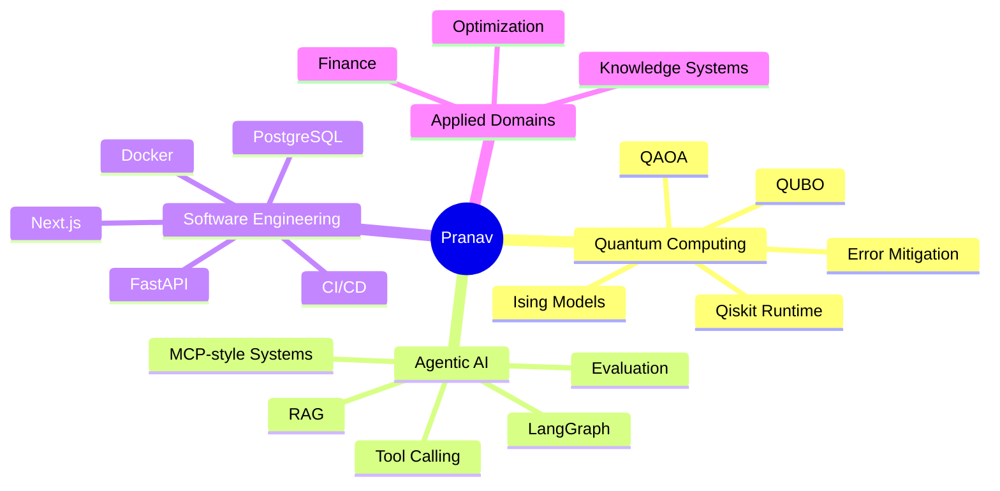

<!--
╔══════════════════════════════════════════════════════════════════════════════╗
║  KONDAPI SRI PRANAV · GitHub Profile README                                  ║
║  Quantum Computing · Agentic AI · Full-Stack Systems                         ║
║                                                                              ║
║  Design notes:                                                               ║
║  • Hero, section cards, and dividers use bespoke SVGs in /assets             ║
║  • Featured Builds use live repo pin cards (real stars / lang / stats)       ║
║  • Section spacing is intentional — do not collapse blank lines around       ║
║    HTML blocks; GitHub markdown needs them to render correctly               ║
╚══════════════════════════════════════════════════════════════════════════════╝
-->

<div align="center">

<!-- ══════════════════════════════ HERO (custom SVG) ══════════════════════════════ -->

<a href="https://pranavks.co.in">
  
</a>

<!-- ══════════════════════════════ TYPING TAGLINE ══════════════════════════════ -->

<a href="https://github.com/pranavks343">
  
</a>

<br/>

<!-- ══════════════════════════════ STATS STRIP ══════════════════════════════ -->


<br/><br/>

<!-- ══════════════════════════════ PRIMARY CTAs ══════════════════════════════ -->

<a href="https://pranavks.co.in"></a>
<a href="https://www.linkedin.com/in/pranav-ks-95342327b"></a>
<a href="mailto:kondapisripranav@gmail.com"></a>
<a href="https://github.com/pranavks343"></a>

</div>

<br/>

<!-- ══════════════════════════════ 30-SECOND PITCH ══════════════════════════════ -->

<div align="center">

> **The 30-second version** &nbsp;·&nbsp; I'm a quantum-computing × AI engineer who **ships**. I formulate real problems as **QUBO / Ising**, run them on **Qiskit**, wire **agentic AI** around them with **LangGraph**, and put it all behind a **FastAPI + Next.js** product surface — typed, dockerized, observable. *Research-grade ideas. Production-grade execution.*

</div>

<br/>

<!-- gradient divider -->


<br/>

<!-- ══════════════════════════════ ABOUT ══════════════════════════════ -->

## &nbsp; Hello, I'm Pranav.

<table>
<tr>
<td width="62%" valign="top">

I work at the intersection of **quantum computing**, **agentic AI**, and **production software systems** — not building demos, but engineering systems that can be reasoned about, tested, deployed, evaluated, and improved.

I obsess over three things:

&nbsp;&nbsp;⚛️ &nbsp;**Quantum optimization** — QUBO, Ising, QAOA, VQE, hybrid solvers
<br/>&nbsp;&nbsp;🧠 &nbsp;**Agentic AI** — LangGraph, tool use, MCP-style workflows, retrieval
<br/>&nbsp;&nbsp;🏗️ &nbsp;**Production engineering** — FastAPI, Next.js, Docker, CI/CD, observability

> *"Research depth. Clean architecture. Shipping velocity."*

📍 &nbsp;Vijayawada, India &nbsp;·&nbsp; 🌐 &nbsp;[pranavks.co.in](https://pranavks.co.in) &nbsp;·&nbsp; 💬 &nbsp;Open to **research collabs**, **internships**, and **hard problems**.

</td>
<td width="38%" valign="top" align="center">


<sub><i>Building at the edge of physics, math, and code.</i></sub>

</td>
</tr>
</table>

<br/>

<!-- ══════════════════════════════ WHOAMI ══════════════════════════════ -->

## ⚡ &nbsp;`whoami`

```python
class KondapiSriPranav:
    role         = "Quantum Computing × Agentic AI Engineer"
    location     = "Vijayawada, India"

    core_stack   = ["Qiskit", "Python", "FastAPI", "LangGraph",
                    "React", "Next.js", "PostgreSQL", "Docker"]

    current_focus = [
        "Hybrid quantum-classical optimization",
        "QUBO / Ising formulation",
        "Agentic AI systems with real tools",
        "Production-grade ML + backend infrastructure",
    ]

    def engineering_philosophy(self) -> str:
        return "Research depth. Clean architecture. Shipping velocity."

    def looking_for(self) -> list[str]:
        return ["Quantum / AI research roles",
                "Applied scientist + engineer hybrids",
                "Teams that value rigor and execution equally"]

    def coffee_to_code(self) -> str:
        return "espresso ⇒ commits"
```

<br/>

<!-- gradient divider -->
<div align="center">

</div>

<br/>

<!-- ══════════════════════════════ ENGINEERING MAP (custom SVGs) ══════════════════════════════ -->

## 🧭 &nbsp;Engineering Map

<table>
<tr>
<td width="50%" valign="top">



### ⚛️ &nbsp;Quantum Computing
Hybrid quantum-classical workflows from theory to runtime.

- QUBO / Ising problem **formulation**
- **QAOA** & variational algorithms
- **Qiskit** circuit construction & transpilation
- Classical-vs-quantum **solver benchmarking**
- **Noise-aware** execution & result validation

</td>
<td width="50%" valign="top">



### 🧠 &nbsp;Agentic AI Systems
AI that uses tools, memory, and retrieval — with eval baked in.

- **LangGraph** agent workflows
- **RAG** pipelines with citations & reranking
- Multi-step **reasoning** systems
- **Evaluation harnesses** (RAGAS-style)
- Backend APIs for AI products

</td>
</tr>
<tr>
<td width="50%" valign="top">



### 🏗️ &nbsp;Backend & Infrastructure
Systems that are clean, testable, and deployable on day one.

- **FastAPI** services with typed contracts
- **PostgreSQL** + vector databases
- **Dockerized** environments end-to-end
- **CI/CD** pipelines via GitHub Actions
- Modular, evolvable architecture

</td>
<td width="50%" valign="top">



### 🎨 &nbsp;Full-Stack Products
Beautiful interfaces around hard, complex systems.

- **React / Next.js** dashboards
- **Streamlit** rapid prototypes
- Clean, versioned **API contracts**
- **Experiment** & evaluation dashboards
- Data and model **visualization**

</td>
</tr>
</table>

<br/>

<!-- gradient divider -->
<div align="center">

</div>

<br/>

<!-- ══════════════════════════════ FEATURED BUILDS (live pin cards) ══════════════════════════════ -->

## 🚀 &nbsp;Featured Builds

<div align="center">

<!-- Row 1 -->
<a href="https://github.com/pranavks343/QuantumPortfolioOptimization">
  
</a>
<a href="https://github.com/pranavks343/ambulance-quantum-optimizer">
  
</a>

<!-- Row 2 -->
<a href="https://github.com/pranavks343/Fidelity-Aware-Quantum-Network-Planner-FAQNP-">
  
</a>
<a href="https://github.com/pranavks343/Multi-Channel-Customer-Query-Router-for-Banking-MCPstyle-">
  
</a>

<!-- Row 3 -->
<a href="https://github.com/pranavks343/CLI-AI-ASSISTANT">
  
</a>
<a href="https://github.com/pranavks343/pdf-knowledge-bot">
  
</a>

<br/><br/>

<a href="https://github.com/pranavks343?tab=repositories">
  
</a>

</div>

<br/>

<!-- ══════════════════════════════ NOW SHIPPING ══════════════════════════════ -->

## 📡 &nbsp;Currently

<table>
<tr>
<td width="34%" valign="top">

### 🛠️ &nbsp;Shipping
Hybrid solver benchmarks, agent-evaluation harness, optimization copilot v2.

</td>
<td width="33%" valign="top">

### 📚 &nbsp;Reading
QAOA depth–accuracy trade-offs, MCP tool-spec patterns, eval-driven LLM systems.

</td>
<td width="33%" valign="top">

### 🌱 &nbsp;Exploring
Error mitigation, structured generation, cost-aware agent routing.

</td>
</tr>
</table>

<br/>

<!-- gradient divider -->
<div align="center">

</div>

<br/>

<!-- ══════════════════════════════ TECH ARSENAL ══════════════════════════════ -->

## 🛠️ &nbsp;Technical Arsenal

<div align="center">

**Languages**
<br/>


<br/>

**AI · ML · Data**
<br/>

<br/>


<br/>

**Quantum**
<br/>


<br/>

**Backend · Frontend · DevOps · Cloud**
<br/>


</div>

<br/>

<details>
<summary><b>📦 &nbsp;Expand: tooling, testing, observability, and the small stuff</b></summary>

<br/>

<div align="center">

**Tooling & DX** — `Poetry` · `uv` · `pre-commit` · `ruff` · `black` · `mypy` · `pytest` · `Vitest`
<br/>
**Observability** — `OpenTelemetry` · `Prometheus` · `Grafana` · `Sentry` · `structlog`
<br/>
**Data** — `pandas` · `NumPy` · `Polars` · `DuckDB` · `pgvector` · `FAISS`
<br/>
**Editor** — `Neovim` · `VS Code` · `JetBrains` &nbsp;·&nbsp; **OS** — `macOS` · `Linux`

</div>

</details>

<br/>

<!-- gradient divider -->
<div align="center">

</div>

<br/>

<!-- ══════════════════════════════ MINDMAP ══════════════════════════════ -->

## 📌 &nbsp;Focus Areas



<br/>

<!-- gradient divider -->
<div align="center">

</div>

<br/>

<!-- ══════════════════════════════ GITHUB SIGNAL ══════════════════════════════ -->

## 📊 &nbsp;GitHub Signal

<div align="center">


<br/><br/>


<br/><br/>


<!--
  ↳ Optional: enable the contribution-snake animation by adding the
    Platane/snk GitHub Action and uncommenting this block.

<picture>
  <source media="(prefers-color-scheme: dark)"  srcset="https://raw.githubusercontent.com/pranavks343/pranavks343/output/github-snake-dark.svg"/>
  <source media="(prefers-color-scheme: light)" srcset="https://raw.githubusercontent.com/pranavks343/pranavks343/output/github-snake.svg"/>
  
</picture>
-->

</div>

<br/>

<!-- gradient divider -->
<div align="center">

</div>

<br/>

<!-- ══════════════════════════════ WHAT I BRING ══════════════════════════════ -->

## 🎯 &nbsp;What I Bring To A Team

<table>
<tr>
<td width="33%" valign="top" align="center">

### 🔬 &nbsp;Research Mindset
I read papers, decompose math-heavy ideas, and turn abstract concepts into **shippable systems**.

</td>
<td width="33%" valign="top" align="center">

### ⚙️ &nbsp;Builder Energy
I get things working **end-to-end** — backend, frontend, models, data, deployment, docs.

</td>
<td width="33%" valign="top" align="center">

### 🧩 &nbsp;Systems Thinking
I think in **architecture, trade-offs, evaluation, failure modes**, and long-term maintainability.

</td>
</tr>
</table>

<br/>

<!-- ══════════════════════════════ QUOTE ══════════════════════════════ -->

<div align="center">


</div>

<br/>

<!-- gradient divider -->
<div align="center">

</div>

<br/>

<!-- ══════════════════════════════ CONNECT ══════════════════════════════ -->

## 📬 &nbsp;Let's Build Something Worth Shipping

<div align="center">

<table>
<tr>
<td align="center">
  <a href="https://pranavks.co.in"></a>
</td>
<td align="center">
  <a href="https://www.linkedin.com/in/pranav-ks-95342327b"></a>
</td>
<td align="center">
  <a href="mailto:kondapisripranav@gmail.com"></a>
</td>
<td align="center">
  <a href="https://github.com/pranavks343"></a>
</td>
</tr>
</table>

<br/>

<sub><i>If you're working on quantum optimization, agentic AI, or production-grade ML systems — let's talk. I usually reply within 24 hours.</i></sub>

<br/><br/>


<sub>⚡ &nbsp;Crafted with intent. &nbsp;·&nbsp; Built to ship. &nbsp;·&nbsp; Designed to last.</sub>

</div>
