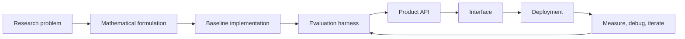

<!--
  KONDAPI SRI PRANAV
  GitHub Profile README

  Built as a high-signal profile page:
  - custom animated SVG hero and domain cards from /assets
  - live GitHub cards and metrics
  - a signature code moment that shows taste, not just claims it
  - concise narrative for recruiters, collaborators, and technical reviewers
-->

<div align="center">

<a href="https://pranavks.co.in">
  
</a>

<br />

<a href="https://github.com/pranavks343">
  
</a>

<br />


<br /><br />

<a href="https://pranavks.co.in"></a>
<a href="https://www.linkedin.com/in/pranav-ks-95342327b"></a>
<a href="mailto:kondapisripranav@gmail.com"></a>
<a href="https://github.com/pranavks343?tab=repositories"></a>

<br /><br />

<!-- Four-pillar domain strip — instant visual key for the work -->


</div>

<br />

<div align="center">

### I turn hard technical ideas into systems people can actually use.

I work where **quantum computing**, **agentic AI**, and **production software** collide: QUBO and Ising formulations, QAOA and hybrid solvers, LangGraph agents, RAG pipelines, FastAPI services, Next.js product surfaces, Dockerized deployments, and evaluation loops that make the system better over time.

**Research depth. Clean architecture. Shipping velocity.**

</div>

<br />


## The Operator Card

<table>
<tr>
<td width="57%" valign="top">

```python
class KondapiSriPranav:
    location = "Vijayawada, India"
    role = "Quantum Computing x Agentic AI Engineer"

    builds = [
        "hybrid quantum-classical optimizers",
        "agentic AI products with real tool use",
        "RAG systems with evaluation and citations",
        "typed APIs, dashboards, and deployment pipelines",
    ]

    stack = {
        "quantum": ["Qiskit", "QAOA", "VQE", "QUBO", "Ising"],
        "ai": ["LangGraph", "LangChain", "RAG", "PyTorch", "Hugging Face"],
        "systems": ["Python", "FastAPI", "Next.js", "PostgreSQL", "Docker"],
    }

    def north_star(self):
        return "Make advanced ideas useful, testable, and shippable."
```

</td>
<td width="43%" valign="top" align="center">


<br />

<b>Currently focused on</b>

Hybrid solvers, agent evaluation, quantum optimization, MCP-style tool workflows, and product-grade AI infrastructure.

</td>
</tr>
</table>

<br />


## Signature

<sub>One pattern that holds my whole stack together — research formulation, quantum execution, classical optimization, and the eval loop that decides if any of it actually worked.</sub>

```python
def hybrid_loop(problem, max_iter: int = 100):
    """A pattern I keep coming back to: hybrid quantum-classical optimization."""
    qubo   = formulate(problem)              # 1. research  — turn the world into a Hamiltonian
    qaoa   = QAOA(cost_hamiltonian=qubo, p=3)# 2. quantum   — variational ansatz
    metric = Evaluator(problem)              # 3. eval      — observable, not vibes

    for step in range(max_iter):
        params  = classical_optimizer(qaoa)  # 4. classical — gradient / COBYLA / SPSA
        bitstr  = qaoa.run(params)           # 5. execute   — circuit on simulator or hardware
        score   = metric(bitstr)             #    measure   — every loop must be defensible

        if metric.converged(score):
            return Result(bitstr=bitstr, score=score, history=metric.history)

    return metric.best_so_far()
```

<br />


## Engineering Domains

<table>
<tr>
<td width="50%" valign="top">


### Quantum Computing

- QUBO and Ising model formulation
- QAOA, VQE, variational workflows
- Qiskit circuits, transpilation, runtime experiments
- Classical baseline vs quantum-inspired benchmarking
- Noise-aware execution and result validation

</td>
<td width="50%" valign="top">


### Agentic AI

- LangGraph workflows with tools and memory
- Retrieval pipelines with citations and reranking
- Structured generation and multi-step reasoning
- Evaluation harnesses for AI behavior
- Backend APIs around intelligent systems

</td>
</tr>
<tr>
<td width="50%" valign="top">


### Backend & Infrastructure

- FastAPI services with typed contracts
- PostgreSQL, Redis, vector stores, and queues
- Dockerized local-to-prod environments
- CI/CD with GitHub Actions
- Observability-first service design

</td>
<td width="50%" valign="top">


### Full-Stack Products

- React and Next.js interfaces
- Dashboards for experiments and insights
- Streamlit prototypes when speed matters
- Clean API boundaries and frontend state
- Data, model, and optimization visualizations

</td>
</tr>
</table>

<br />


## Featured Builds

<table>
<tr>
<td width="50%" valign="top">

### ⚛&nbsp; [Quantum Portfolio Optimization](https://github.com/pranavks343/QuantumPortfolioOptimization)

Hybrid quantum-classical portfolio optimizer. **Mean-variance with cardinality** posed as QUBO, run via QAOA against a classical baseline for honest benchmarking.

<a href="https://github.com/pranavks343/QuantumPortfolioOptimization/stargazers"></a>


<sub>`Qiskit` &nbsp;·&nbsp; `QAOA` &nbsp;·&nbsp; `QUBO` &nbsp;·&nbsp; `Finance`</sub>

</td>
<td width="50%" valign="top">

### 🌐&nbsp; [Fidelity-Aware Quantum Network Planner](https://github.com/pranavks343/Fidelity-Aware-Quantum-Network-Planner-FAQNP-)

Plans entanglement distribution across quantum networks with **explicit fidelity budgeting**. Research-grade tooling for repeater placement and route selection.

<a href="https://github.com/pranavks343/Fidelity-Aware-Quantum-Network-Planner-FAQNP-/stargazers"></a>


<sub>`Quantum Networks` &nbsp;·&nbsp; `Optimization` &nbsp;·&nbsp; `Research`</sub>

</td>
</tr>
<tr>
<td width="50%" valign="top">

### 🏦&nbsp; [MCP-Style Banking Query Router](https://github.com/pranavks343/Multi-Channel-Customer-Query-Router-for-Banking-MCPstyle-)

Multi-channel customer-query router built around **MCP-style tool specs**. Routes intents across channels with structured tool calls and explicit fallback paths.

<a href="https://github.com/pranavks343/Multi-Channel-Customer-Query-Router-for-Banking-MCPstyle-/stargazers"></a>


<sub>`MCP` &nbsp;·&nbsp; `LangGraph` &nbsp;·&nbsp; `Tool Use` &nbsp;·&nbsp; `Banking`</sub>

</td>
<td width="50%" valign="top">

### 💻&nbsp; [CLI AI Assistant](https://github.com/pranavks343/CLI-AI-ASSISTANT)

Agentic CLI with **tool use, persistent memory, and shell-aware reasoning**. Built for engineers who live in the terminal.

<a href="https://github.com/pranavks343/CLI-AI-ASSISTANT/stargazers"></a>


<sub>`Agents` &nbsp;·&nbsp; `Tool Use` &nbsp;·&nbsp; `CLI` &nbsp;·&nbsp; `Memory`</sub>

</td>
</tr>
<tr>
<td width="50%" valign="top">

### 🧾&nbsp; [PDF Knowledge Bot](https://github.com/pranavks343/pdf-knowledge-bot)

Document intelligence with **hybrid retrieval, reranking, and citations**. Source-grounded answers from your PDFs — eval-ready and audit-friendly.

<a href="https://github.com/pranavks343/pdf-knowledge-bot/stargazers"></a>


<sub>`RAG` &nbsp;·&nbsp; `Vector Search` &nbsp;·&nbsp; `Reranking` &nbsp;·&nbsp; `Citations`</sub>

</td>
<td width="50%" valign="top">&nbsp;</td>
</tr>
</table>

<div align="center">

<br />

<a href="https://github.com/pranavks343?tab=repositories">
  
</a>

</div>

<br />


## Stack Matrix

<div align="center">

<b>Languages</b>


<b>AI, ML, and Data</b>


<br />


<b>Quantum</b>


<b>Product Engineering</b>


</div>

<details>
<summary><b>More tools I reach for</b></summary>

<br />

<div align="center">

`Poetry` · `uv` · `pytest` · `ruff` · `black` · `mypy` · `Vitest` · `OpenTelemetry` · `Prometheus` · `Grafana` · `Sentry` · `pandas` · `NumPy` · `Polars` · `DuckDB` · `pgvector` · `FAISS`

</div>

</details>

<details>
<summary><b>What I'm reading right now</b></summary>

<br />

<table>
<tr>
<td valign="top" width="33%">

**Quantum**
- Variational quantum algorithms — depth, noise, expressibility
- QAOA performance on hard combinatorial structure
- Error mitigation that survives outside the lab

</td>
<td valign="top" width="34%">

**AI Systems**
- MCP, tool-spec patterns, structured generation
- LLM evaluation methodology beyond benchmarks
- Agent architectures with measurable tool use

</td>
<td valign="top" width="33%">

**Engineering**
- Distributed systems, observability, recovery
- Optimization theory and combinatorics
- Building products around uncertain models

</td>
</tr>
</table>

</details>

<br />


## How I Think



<sub align="center"><i>The loop on the right is the part most projects skip. I treat it as the product.</i></sub>

<table>
<tr>
<td width="33%" valign="top">

### Research Mindset

I like paper-to-product work: understand the math, extract the usable mechanism, and prove it with experiments.

</td>
<td width="34%" valign="top">

### Systems Taste

I care about APIs, contracts, observability, failure modes, and code that another engineer can inherit.

</td>
<td width="33%" valign="top">

### Shipping Bias

I build end-to-end: model, backend, frontend, deployment, docs, and the feedback loop after launch.

</td>
</tr>
</table>

<br />


## GitHub Signal

<div align="center">


<br /><br />


<br /><br />

<!-- Profile summary cards: deeper, more specific signal than generic trophies -->


<br /><br />


<br /><br />


<br /><br />


<!--
  Snake animation — enable after adding the Platane/snk GitHub Action
  (.github/workflows/snake.yml). Until then it 404s, so it's commented.

<picture>
  <source media="(prefers-color-scheme: dark)"  srcset="https://raw.githubusercontent.com/pranavks343/pranavks343/output/github-snake-dark.svg" />
  <source media="(prefers-color-scheme: light)" srcset="https://raw.githubusercontent.com/pranavks343/pranavks343/output/github-snake.svg" />
  
</picture>
-->

</div>

<br />


## Current Radar

<table>
<tr>
<td width="25%" valign="top">

### Shipping

Hybrid solver benchmarks and optimization copilots.

</td>
<td width="25%" valign="top">

### Studying

QAOA depth, noise behavior, and error mitigation.

</td>
<td width="25%" valign="top">

### Building

Agent workflows with measurable tool use.

</td>
<td width="25%" valign="top">

### Looking For

Quantum, AI, research engineering, and serious product work.

</td>
</tr>
</table>

<br />


<div align="center">

<br />

<!-- The line worth quoting -->
> ### *The most interesting work right now lives at the seam between research and production.*
> ### *Quantum is hard. AI is hot. Engineering is what makes both real.*

<br />


<br /><br />

### Build With Me

If you are working on quantum optimization, agentic AI, intelligent infrastructure, or a research idea that deserves production execution, I want to hear about it.

<sub><i>I usually reply within 24 hours.</i></sub>

<br />

<a href="https://pranavks.co.in"></a>
<a href="https://www.linkedin.com/in/pranav-ks-95342327b"></a>
<a href="mailto:kondapisripranav@gmail.com"></a>

<br /><br />


<sub>Designed with intent. Built to ship. Tuned for signal.</sub>

</div>
