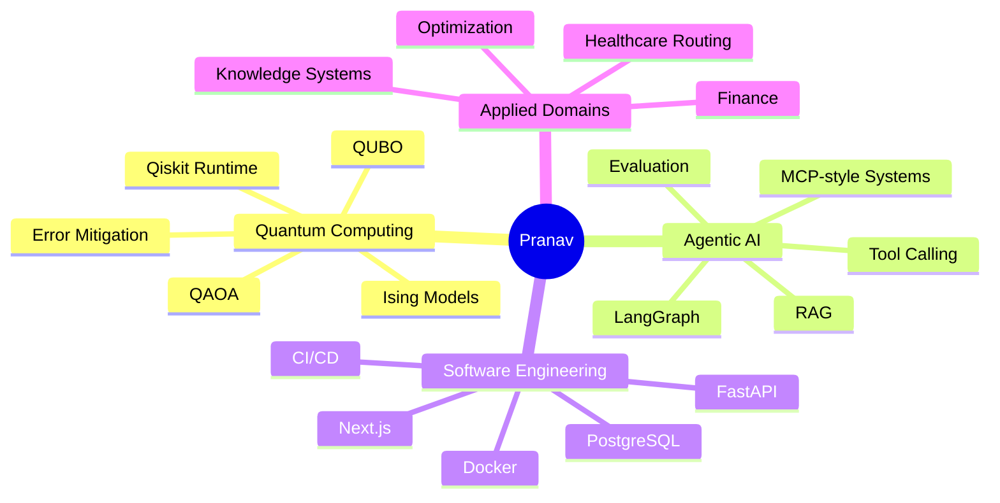

<!--
╔══════════════════════════════════════════════════════════════════════════════╗
║  KONDAPI SRI PRANAV · GitHub Profile README                                  ║
║  Quantum Computing · Agentic AI · Full-Stack Systems                         ║
╚══════════════════════════════════════════════════════════════════════════════╝
-->

<div align="center">

<!-- ══════════════════════════════ HERO BANNER ══════════════════════════════ -->


<!-- ══════════════════════════════ TYPING TAGLINE ══════════════════════════════ -->

<a href="https://github.com/pranavks343">
  
</a>

<br/>

<!-- ══════════════════════════════ STATS STRIP ══════════════════════════════ -->


<br/><br/>

<!-- ══════════════════════════════ PRIMARY CTAs ══════════════════════════════ -->

<a href="https://pranavks.co.in">
  
</a>
<a href="https://www.linkedin.com/in/pranav-ks-95342327b">
  
</a>
<a href="mailto:kondapisripranav@gmail.com">
  
</a>
<a href="https://github.com/pranavks343">
  
</a>

</div>

<br/>

<!-- ══════════════════════════════ ABOUT ══════════════════════════════ -->

## <picture><source media="(prefers-color-scheme: dark)" srcset="https://media.giphy.com/media/hvRJCLFzcasrR4ia7z/giphy.gif" /></picture> &nbsp;Hello, I'm Pranav.

<table>
<tr>
<td width="62%" valign="top">

I work at the intersection of **quantum computing**, **agentic AI**, and **production software systems** — not building demos, but engineering systems that can be reasoned about, tested, deployed, evaluated, and improved.

I obsess over three things:

&nbsp;&nbsp;⚛️ &nbsp;**Quantum optimization** — QUBO, Ising, QAOA, VQE, hybrid solvers
<br/>&nbsp;&nbsp;🧠 &nbsp;**Agentic AI** — LangGraph, tool use, MCP-style workflows, retrieval
<br/>&nbsp;&nbsp;🏗️ &nbsp;**Production engineering** — FastAPI, Next.js, Docker, CI/CD, observability

> *"Research depth. Clean architecture. Shipping velocity."*

📍 &nbsp;Vijayawada, India &nbsp;·&nbsp; 🌐 &nbsp;[pranavks.co.in](https://pranavks.co.in) &nbsp;·&nbsp; 💬 &nbsp;Always open to **research collabs**, **internships**, and **hard problems**.

</td>
<td width="38%" valign="top" align="center">


</td>
</tr>
</table>

<br/>

<!-- ══════════════════════════════ WHO I AM (CODE) ══════════════════════════════ -->

## ⚡ &nbsp;`whoami`

```python
class KondapiSriPranav:
    role         = "Quantum Computing × Agentic AI Engineer"
    location     = "Vijayawada, India"

    core_stack   = ["Qiskit", "Python", "FastAPI", "LangGraph",
                    "React", "Next.js", "PostgreSQL", "Docker"]

    current_focus = [
        "Hybrid quantum-classical optimization",
        "QUBO / Ising formulation",
        "Agentic AI systems with real tools",
        "Production-grade ML + backend infrastructure",
    ]

    def engineering_philosophy(self) -> str:
        return "Research depth. Clean architecture. Shipping velocity."

    def looking_for(self) -> list[str]:
        return ["Quantum / AI research roles",
                "Applied scientist + engineer hybrids",
                "Teams who value rigor and execution equally"]
```

<br/>

<!-- ══════════════════════════════ ENGINEERING MAP ══════════════════════════════ -->

## 🧭 &nbsp;Engineering Map

<table>
<tr>
<td width="50%" valign="top">

### ⚛️ &nbsp;Quantum Computing
Hybrid quantum–classical workflows from theory to runtime.

- QUBO / Ising problem **formulation**
- **QAOA** & variational algorithms
- **Qiskit** circuit construction & transpilation
- Classical-vs-quantum **solver benchmarking**
- **Noise-aware** execution & result validation

</td>
<td width="50%" valign="top">

### 🧠 &nbsp;Agentic AI Systems
AI that uses tools, memory, and retrieval — with eval baked in.

- **LangGraph** agent workflows
- **RAG** pipelines with citations & reranking
- Multi-step **reasoning** systems
- **Evaluation harnesses** (RAGAS-style)
- Backend APIs for AI products

</td>
</tr>
<tr>
<td width="50%" valign="top">

### 🏗️ &nbsp;Backend & Infrastructure
Systems that are clean, testable, and deployable on day one.

- **FastAPI** services with typed contracts
- **PostgreSQL** + vector databases
- **Dockerized** environments end-to-end
- **CI/CD** pipelines via GitHub Actions
- Modular, evolvable architecture

</td>
<td width="50%" valign="top">

### 🎨 &nbsp;Full-Stack Products
Beautiful interfaces around hard, complex systems.

- **React / Next.js** dashboards
- **Streamlit** rapid prototypes
- Clean, versioned **API contracts**
- **Experiment** & evaluation dashboards
- Data and model **visualization**

</td>
</tr>
</table>

<br/>

<!-- ══════════════════════════════ FEATURED BUILDS ══════════════════════════════ -->

## 🚀 &nbsp;Featured Builds

<table>
<tr>
<td width="50%" valign="top">

### ⚛️ &nbsp;Agentic Quantum Optimization Copilot
A hybrid quantum–classical platform that converts real-world optimization problems into **QUBO / Ising** formulations, selects solvers, runs experiments, and benchmarks classical vs quantum results.

`QUBO` &nbsp;`Ising` &nbsp;`QAOA` &nbsp;`Qiskit` &nbsp;`LangGraph` &nbsp;`FastAPI`

</td>
<td width="50%" valign="top">

### 🚑 &nbsp;Quantum-AI Ambulance Routing
Emergency dispatch optimization using classical heuristics + quantum-inspired formulations — engineered around real constraints: ambulance type, urgency, hospital distance, response-time penalties.

`routing` &nbsp;`QUBO` &nbsp;`simulation` &nbsp;`healthcare` &nbsp;`dashboards`

</td>
</tr>
<tr>
<td width="50%" valign="top">

### 📈 &nbsp;AI Financial Advisor
LLM-powered financial intelligence — market data, NLP, sentiment, and reasoning to support portfolio analysis, news understanding, and personal finance guidance.

`LLMs` &nbsp;`NLP` &nbsp;`market data` &nbsp;`RAG` &nbsp;`FastAPI` &nbsp;`React`

</td>
<td width="50%" valign="top">

### 🧾 &nbsp;Ask My Docs — Hybrid RAG
Document intelligence with **hybrid retrieval, reranking, citations, and answer evaluation** — answers from your docs, source-grounded.

`BM25` &nbsp;`vector search` &nbsp;`reranking` &nbsp;`RAGAS` &nbsp;`FastAPI`

</td>
</tr>
</table>

<div align="center">

<a href="https://github.com/pranavks343?tab=repositories">
  
</a>

</div>

<br/>

<!-- ══════════════════════════════ TECH ARSENAL ══════════════════════════════ -->

## 🛠️ &nbsp;Technical Arsenal

<div align="center">

**Languages**
<br/>


<br/>

**AI · ML · Data**
<br/>

<br/>


<br/>

**Quantum**
<br/>


<br/>

**Backend · Frontend · DevOps · Cloud**
<br/>


</div>

<br/>

<!-- ══════════════════════════════ FOCUS MINDMAP ══════════════════════════════ -->

## 📌 &nbsp;Current Focus



<br/>

<!-- ══════════════════════════════ GITHUB SIGNAL ══════════════════════════════ -->

## 📊 &nbsp;GitHub Signal

<div align="center">


<br/><br/>


<br/><br/>


</div>

<br/>

<!-- ══════════════════════════════ WHAT I BRING ══════════════════════════════ -->

## 🎯 &nbsp;What I Bring To A Team

<table>
<tr>
<td width="33%" valign="top" align="center">

### 🔬 &nbsp;Research Mindset
I read papers, decompose math-heavy ideas, and turn abstract concepts into **shippable systems**.

</td>
<td width="33%" valign="top" align="center">

### ⚙️ &nbsp;Builder Energy
I get things working **end-to-end** — backend, frontend, models, data, deployment, docs.

</td>
<td width="33%" valign="top" align="center">

### 🧩 &nbsp;Systems Thinking
I think in **architecture, trade-offs, evaluation, failure modes**, and long-term maintainability.

</td>
</tr>
</table>

<br/>

<!-- ══════════════════════════════ QUOTE ══════════════════════════════ -->

<div align="center">


</div>

<br/>

<!-- ══════════════════════════════ CONNECT ══════════════════════════════ -->

## 📬 &nbsp;Let's Build Something Worth Shipping

<div align="center">

<table>
<tr>
<td align="center">
  <a href="https://pranavks.co.in">
    
  </a>
</td>
<td align="center">
  <a href="https://www.linkedin.com/in/pranav-ks-95342327b">
    
  </a>
</td>
<td align="center">
  <a href="mailto:kondapisripranav@gmail.com">
    
  </a>
</td>
<td align="center">
  <a href="https://github.com/pranavks343">
    
  </a>
</td>
</tr>
</table>

<br/>

<sub><i>If you're working on quantum optimization, agentic AI, or production-grade ML systems — let's talk.</i></sub>

<br/><br/>


<sub>⚡ &nbsp;Crafted with intent. &nbsp;·&nbsp; Built to ship. &nbsp;·&nbsp; Designed to last.</sub>

</div>
