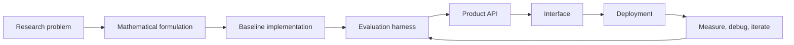

<!--
  KONDAPI SRI PRANAV
  GitHub Profile README

  Built as a high-signal profile page:
  - custom animated SVG hero and domain cards from /assets
  - live GitHub cards and metrics
  - concise narrative for recruiters, collaborators, and technical reviewers
-->

<div align="center">

<a href="https://pranavks.co.in">
  
</a>

<br />

<a href="https://github.com/pranavks343">
  
</a>

<br />


<br /><br />

<a href="https://pranavks.co.in"></a>
<a href="https://www.linkedin.com/in/pranav-ks-95342327b"></a>
<a href="mailto:kondapisripranav@gmail.com"></a>
<a href="https://github.com/pranavks343?tab=repositories"></a>

</div>

<br />

<div align="center">

### I turn hard technical ideas into systems people can actually use.

I work where **quantum computing**, **agentic AI**, and **production software** collide: QUBO and Ising formulations, QAOA and hybrid solvers, LangGraph agents, RAG pipelines, FastAPI services, Next.js product surfaces, Dockerized deployments, and evaluation loops that make the system better over time.

**Research depth. Clean architecture. Shipping velocity.**

</div>

<br />


## The Operator Card

<table>
<tr>
<td width="57%" valign="top">

```python
class KondapiSriPranav:
    location = "Vijayawada, India"
    role = "Quantum Computing x Agentic AI Engineer"

    builds = [
        "hybrid quantum-classical optimizers",
        "agentic AI products with real tool use",
        "RAG systems with evaluation and citations",
        "typed APIs, dashboards, and deployment pipelines",
    ]

    stack = {
        "quantum": ["Qiskit", "QAOA", "VQE", "QUBO", "Ising"],
        "ai": ["LangGraph", "LangChain", "RAG", "PyTorch", "Hugging Face"],
        "systems": ["Python", "FastAPI", "Next.js", "PostgreSQL", "Docker"],
    }

    def north_star(self):
        return "Make advanced ideas useful, testable, and shippable."
```

</td>
<td width="43%" valign="top" align="center">


<br />

<b>Currently focused on</b>

Hybrid solvers, agent evaluation, quantum optimization, MCP-style tool workflows, and product-grade AI infrastructure.

</td>
</tr>
</table>

<br />

## Engineering Domains

<table>
<tr>
<td width="50%" valign="top">


### Quantum Computing

- QUBO and Ising model formulation
- QAOA, VQE, variational workflows
- Qiskit circuits, transpilation, runtime experiments
- Classical baseline vs quantum-inspired benchmarking
- Noise-aware execution and result validation

</td>
<td width="50%" valign="top">


### Agentic AI

- LangGraph workflows with tools and memory
- Retrieval pipelines with citations and reranking
- Structured generation and multi-step reasoning
- Evaluation harnesses for AI behavior
- Backend APIs around intelligent systems

</td>
</tr>
<tr>
<td width="50%" valign="top">


### Backend & Infrastructure

- FastAPI services with typed contracts
- PostgreSQL, Redis, vector stores, and queues
- Dockerized local-to-prod environments
- CI/CD with GitHub Actions
- Observability-first service design

</td>
<td width="50%" valign="top">


### Full-Stack Products

- React and Next.js interfaces
- Dashboards for experiments and insights
- Streamlit prototypes when speed matters
- Clean API boundaries and frontend state
- Data, model, and optimization visualizations

</td>
</tr>
</table>

<br />


## Featured Builds

<div align="center">

<a href="https://github.com/pranavks343/QuantumPortfolioOptimization">
  
</a>
<a href="https://github.com/pranavks343/ambulance-quantum-optimizer">
  
</a>
<a href="https://github.com/pranavks343/Fidelity-Aware-Quantum-Network-Planner-FAQNP-">
  
</a>
<a href="https://github.com/pranavks343/Multi-Channel-Customer-Query-Router-for-Banking-MCPstyle-">
  
</a>
<a href="https://github.com/pranavks343/CLI-AI-ASSISTANT">
  
</a>
<a href="https://github.com/pranavks343/pdf-knowledge-bot">
  
</a>

<br /><br />

<a href="https://github.com/pranavks343?tab=repositories">
  
</a>

</div>

<br />

## Stack Matrix

<div align="center">

<b>Languages</b>


<b>AI, ML, and Data</b>


<br />


<b>Quantum</b>


<b>Product Engineering</b>


</div>

<details>
<summary><b>More tools I reach for</b></summary>

<br />

<div align="center">

`Poetry` · `uv` · `pytest` · `ruff` · `black` · `mypy` · `Vitest` · `OpenTelemetry` · `Prometheus` · `Grafana` · `Sentry` · `pandas` · `NumPy` · `Polars` · `DuckDB` · `pgvector` · `FAISS`

</div>

</details>

<br />


## How I Think



<table>
<tr>
<td width="33%" valign="top">

### Research Mindset

I like paper-to-product work: understand the math, extract the usable mechanism, and prove it with experiments.

</td>
<td width="34%" valign="top">

### Systems Taste

I care about APIs, contracts, observability, failure modes, and code that another engineer can inherit.

</td>
<td width="33%" valign="top">

### Shipping Bias

I build end-to-end: model, backend, frontend, deployment, docs, and the feedback loop after launch.

</td>
</tr>
</table>

<br />

## GitHub Signal

<div align="center">


<br /><br />


<br /><br />


</div>

<br />


## Current Radar

<table>
<tr>
<td width="25%" valign="top">

### Shipping

Hybrid solver benchmarks and optimization copilots.

</td>
<td width="25%" valign="top">

### Studying

QAOA depth, noise behavior, and error mitigation.

</td>
<td width="25%" valign="top">

### Building

Agent workflows with measurable tool use.

</td>
<td width="25%" valign="top">

### Looking For

Quantum, AI, research engineering, and serious product work.

</td>
</tr>
</table>

<br />

<div align="center">


<br /><br />

### Build With Me

If you are working on quantum optimization, agentic AI, intelligent infrastructure, or a research idea that deserves production execution, I want to hear about it.

<a href="https://pranavks.co.in"></a>
<a href="https://www.linkedin.com/in/pranav-ks-95342327b"></a>
<a href="mailto:kondapisripranav@gmail.com"></a>

<br /><br />


<sub>Designed with intent. Built to ship. Tuned for signal.</sub>

</div>
